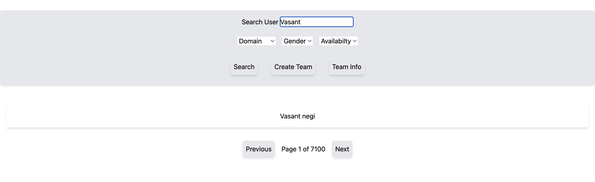
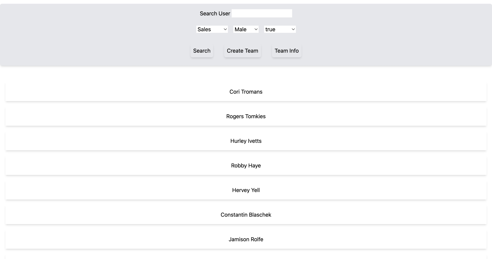
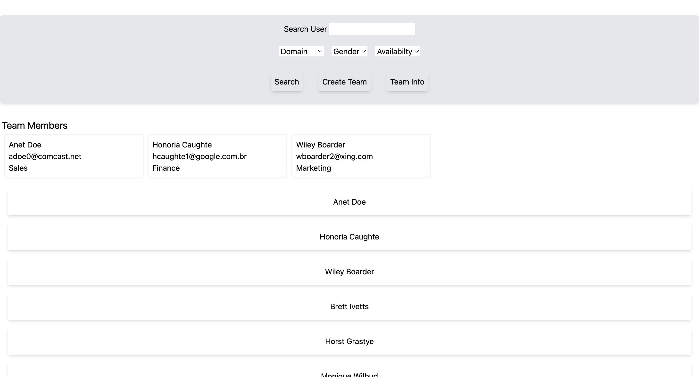
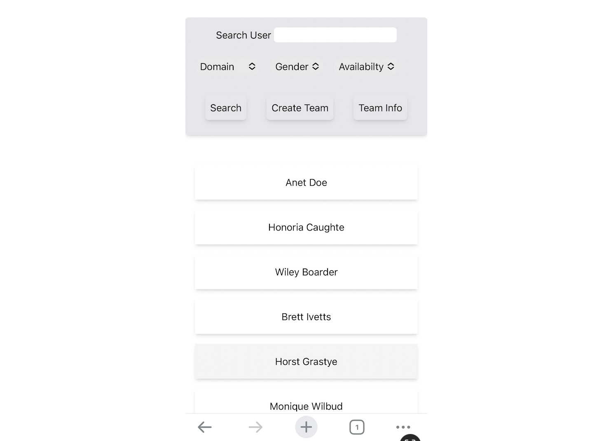
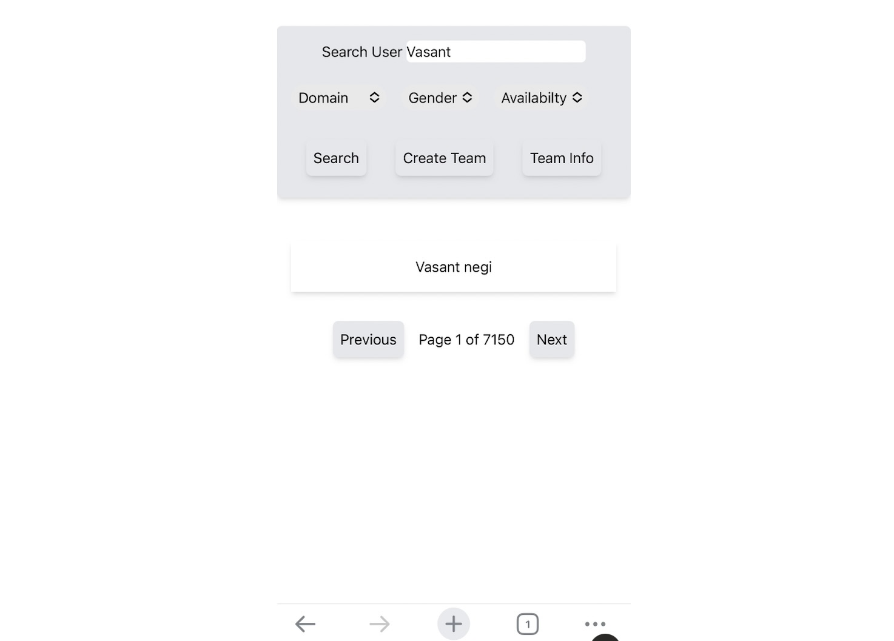
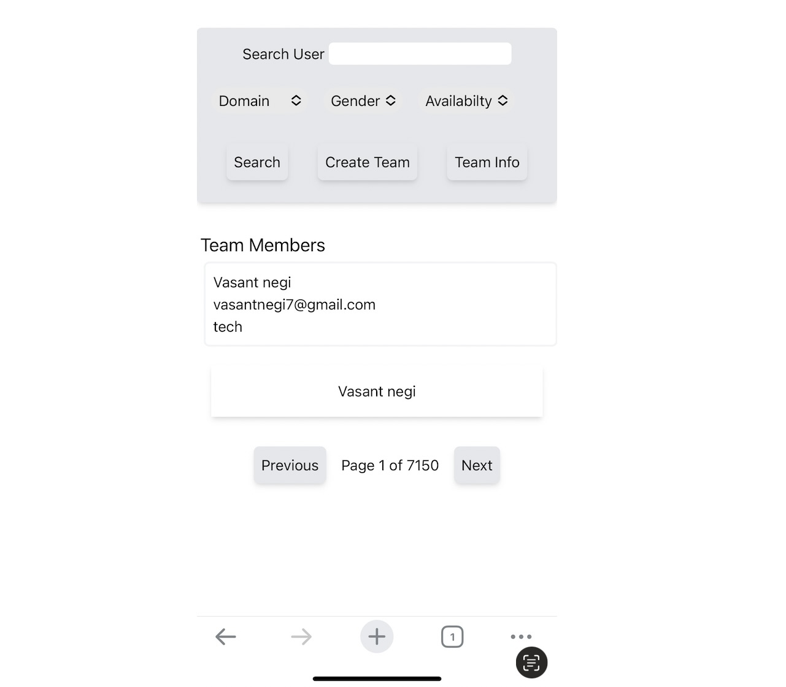

# Project

# Frontend & Backend

Tech Stack frontend : React js , Tailwind css
Tech stack backend : Node js , Express , MongoDB

# Feature & Visual

1. All user from mockData are displayed on landing page

2. All can search for a user based on name or mock data id.

Steps to search --> write down user first name name and press enter.

3. Can filter user based on domain , gender , Availability

Steps to search based on filter --> choose option from from the drop downs click on search button

4. Can create team randomly or by using filters & see team info(Domain, Gender, Availability )

Steps to create a team --> click on users and then click create team button, alert will appear , to show team info click on team info button.

5. Responsiveness

Designed with mobile first approch , application is responsive on mobile, tablet, lg screens

  
